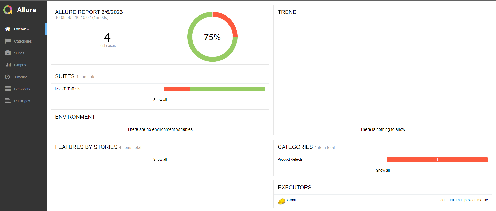
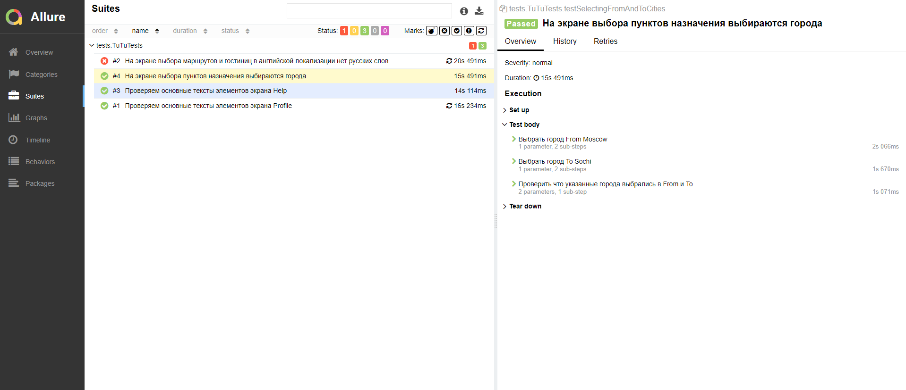

# Проект по автоматизации тестирования мобильного приложения Tutu.ru

<code></code>
#### <a target="_blank" href="https://www.tutu.ru/">tutu</a>

#### Тестирование проводилось c использованием Android Studio + Appium Server GUI на локальном эмуляторе

# :closed_book:    Содержание

> - [Технологии и инструменты](#toolbox-технологии-и-инструменты)
>
> - [Реализованы проверки](#chart_with_upwards_trend-реализованы-проверки)
>
> - [Отчет о результатах тестирования в Allure Report](#triangular_flag_on_post-отчет-о-результатах-тестирования-в-allure-report)
>

## :toolbox: Технологии и инструменты

</code>
<code></code>
<code></code>
<code></code>
<code></code>
<code></code>
<code></code>
<code></code>
<code></code>

> - *В данном проекте использовались:*
>- *<code><strong>*Java*</strong></code> с использованием фреймворка <code><strong>*Selenide*</strong></code> -
   автотесты для UI*
>- *<code><strong>*Gradle*</strong></code> - сборка проекта*
>- *<code><strong>*JUnit 5*</strong></code> - фреймворк для модульного тестирования*
>- *<code><strong>*Allure Report*</strong></code> - визуализации результатов тестирования*
>- *<code><strong>*Appium*</strong></code> - среда автоматизации тестирования для использования с нативными, гибридными и мобильными веб-приложениями*
>- *<code><strong>*Android Studio*</strong></code> - интегрированная среда разработки (IDE) для работы с платформой Android*

## :chart_with_upwards_trend: Реализованы проверки

### Mobile

#### ✓ Тесты

> - [x] *Выбор города*
>- [x] *В английской локализации нет русских слов на экране выбора маршрутов и гостиниц*
>- [x] *Проверка основных текстов элементов экрана Help*
>- [x] *Проверка основных текстов элементов экрана Profile*

## :triangular_flag_on_post: Отчет о результатах тестирования в Allure Report

 

  

  

Описания тестов и шагов тестов создаётся автоматически, на основе аннотаций и степов, созданных в исходном коде.

#### ✓ Видео выполнения мобильного теста :

  

